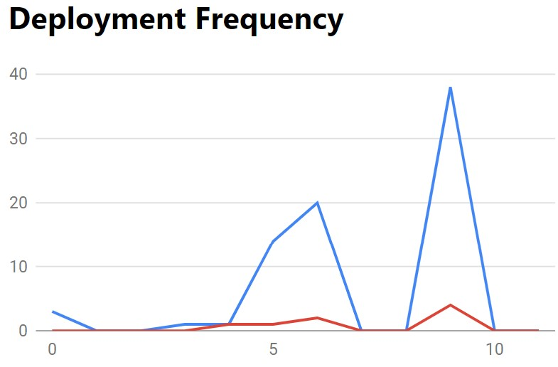
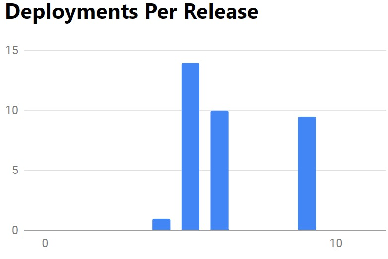
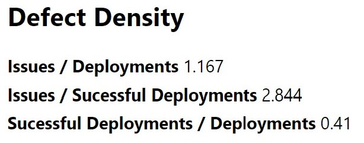
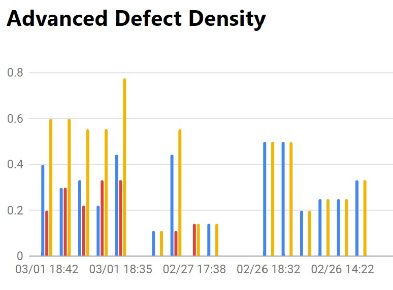
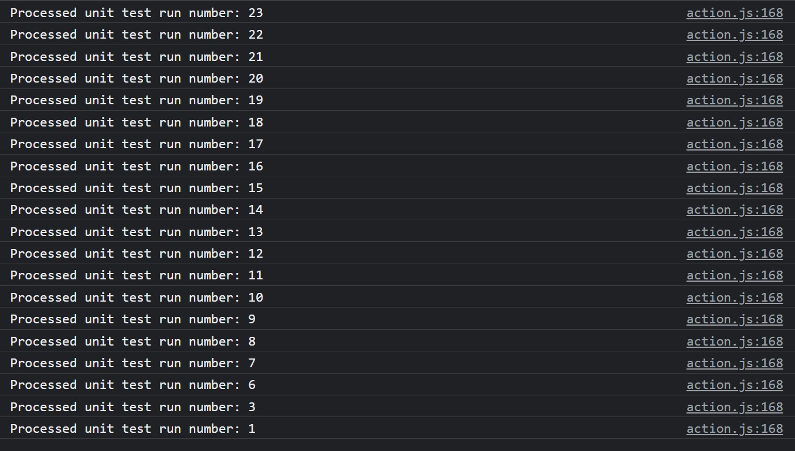

# DevOps-for-GitHub
A Google Chrome extension that can visualize DevOps evaluation metrics. 
The repository includes all files necessary to set up the extension, and the milestone assignments are in the "milestones" folder. 

## Install
First, clone the project to your local repository and enter the directory:
```console
git clone https://github.com/tsai00150/DevOps-for-GitHub.git
cd DevOps-for-GitHub
```
Within the root directory, create a new file called `config.json`. Before writing to `config.json`, [create a fine-grained personal access token](https://docs.github.com/en/authentication/keeping-your-account-and-data-secure/creating-a-personal-access-token#creating-a-fine-grained-personal-access-token), and copy the token. Inside the file `config.json`, enter the following:
```json
{
    "token": "<your Fine-grained personal access token>"
}
```

Next, follow the instructions on [Loading an unpacked extension](https://developer.chrome.com/docs/extensions/mv3/getstarted/development-basics/#load-unpacked), located in Chrome Developers Documentation. Make sure to choose your cloned project directory as your extension directory.

[Pin the extension](https://developer.chrome.com/docs/extensions/mv3/getstarted/development-basics/#pin), and you are set to use the extension. 

If the graphs do not come out for a significant amount of time, we recommend trying it at a later time or use a VPN to change your IP address. This is caused by GitHub's [rate limit](https://www.endorlabs.com/blog/how-to-get-the-most-out-of-github-api-rate-limits) on the API.  

Note: Although the extension was designed with Google Chrome in mind, it is also able to load to Microsoft Edge. The steps are the same, except that the button to turn on developer mode and load an unpacked extension might be in different locations. 

## Usage 
Given the initial parameters, you should see graphs similar to this:




For Advanced Defect Density, your GitHub account (same as the token) would need to own a repository that runs workflows with Python's `unittest`. By default, the chart should not run. Below is an example that runs on my [repository](https://github.com/tsai00150/devops-user-study/actions). 
. 

It might take some time to get the chart. Right-click the popup, click `inspect`, and you should see something like the picture below. The chart is running if the console continues to update. 



## Acknowledgement
* [GitHub REST API](https://docs.github.com/en/rest?apiVersion=2022-11-28) - All data are obtained via the GitHub REST API. 
* [JSZip](https://stuk.github.io/jszip/) - The project uses JSZip, a Javascript library, to help unzip the log files obtained through GitHub API. The library is stored locally to comply the Content Security Policy for Chrome Apps, located at `scripts/jszip.min.js`. 
* [Google Charts](https://developers.google.com/chart/interactive/docs) - The charts are drawn using Google Charts. 
* [Natrium](https://github.com/appditto/natrium_wallet_flutter) - The instructions for parameter input uses the GitHub Actions data of the repository as an example. 
* [Icon](https://icon-icons.com/icon/among-us-player-red/156942) - Currently using the player icon from Among Us. 