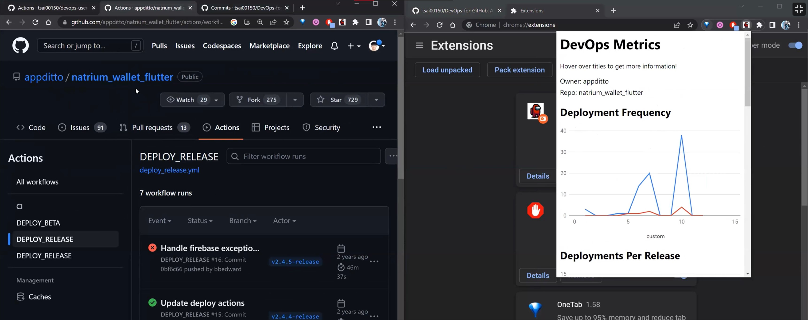
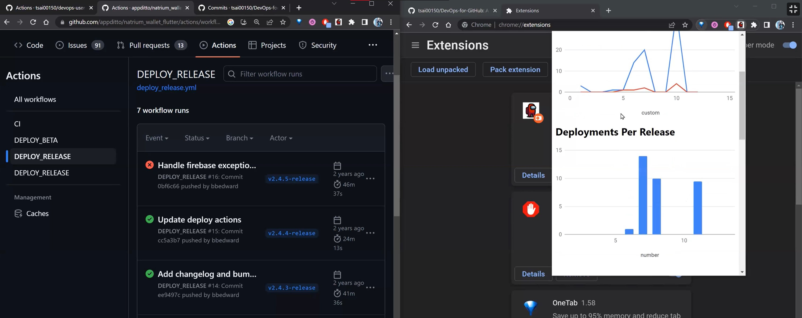
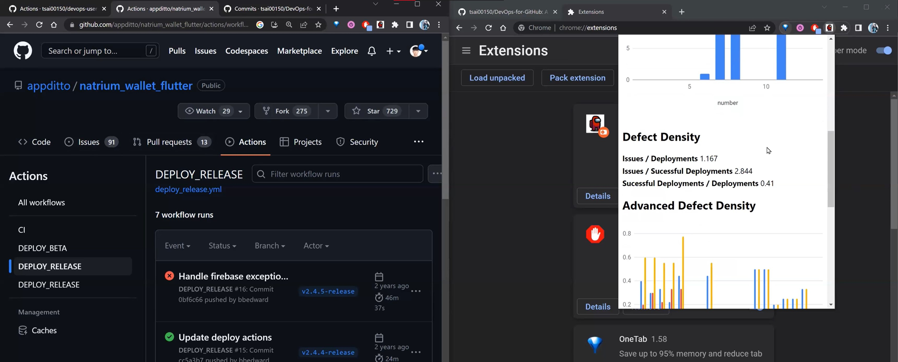
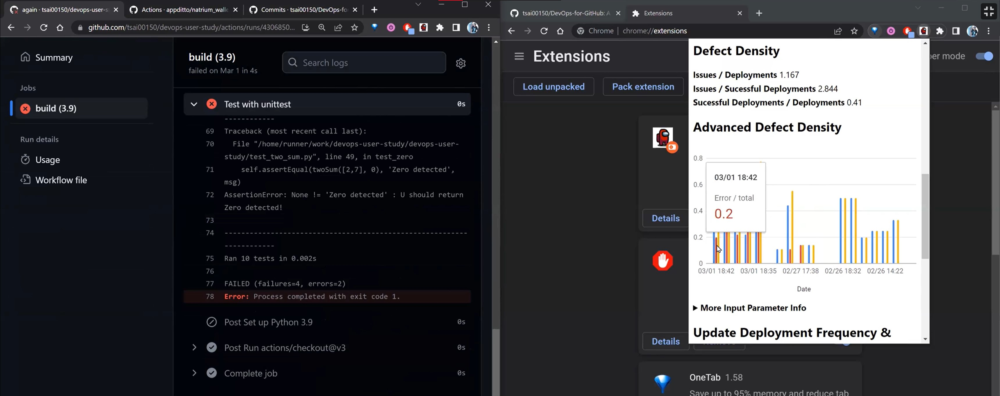
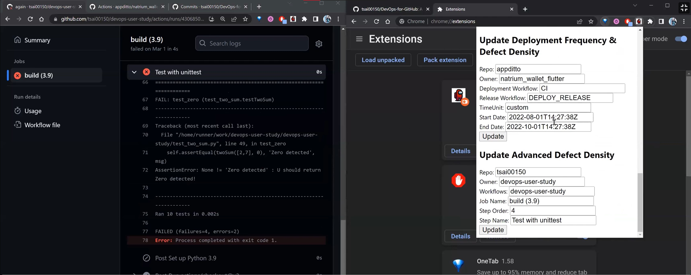

# DevOps-for-GitHub
A Google Chrome extension that can visualize DevOps evaluation metrics. Developed by Siyang Zhang and Tsai-Chen Hsieh. 

## Usage 
The first metric in our extension is Deployment Frequency, which in our implementation, needs to define a workflow that runs whenever a deployment happens. The metric can be calculated by `the deployment workflows that ran (blue) / time unit`. Release workflows (red) are also included for reference. There are four options for the time unit: week, month, year, and custom development cycles. Each time unit starts from the current day and displays data up to 11 units of time earlier. 


The next metric “Deployments Per Release” is calculated as the `number of deployments/releases in a certain period`. The time unit is the same as Deployment Frequency. 


There are three metrics related to Defect Density:
* Issues / Deployments: This represents on average, how many unsolved GitHub Issues per deployment. The lower the better, which represents a higher software quality. 
* Issues / Successful Deployments: For this metric, the lower the better, which again represents a higher software quality. The switch of the denominator to successful deployments is useful to examine the unit test process; if the metric is too high, we would need better unit test processes to catch the errors. 
* Successful Deployments / Deployments: This calculates the percentage of successfully executing a deployment. The higher the metric, the better. If the score is too low, then the development team should consider doing more checks before deployment. 



For Advanced Defect Density, your GitHub account (same as the token) would need to own a repository that runs workflows with Python's `unittest`. By default, the chart should not run. Below is an example that runs on my [repository](https://github.com/tsai00150/devops-user-study/actions). 

For the chart, there are three bars for each unit test execution: blue is the failure ratio, red is the error ratio, and yellow is the ratio of the unit tests not passed. Here failure means the code gives the wrong result, error means the code does not run successfully. This metric is also detecting software defects but from the unit test’s perspective, which makes it another method to evaluate DevOps.


There is also a section to customize different repositories and their parameters. As long as the GitHub repository is public and the parameters are correct, the graph will render.  


## Install
First, clone the project to your local repository and enter the directory:
```console
git clone https://github.com/tsai00150/DevOps-for-GitHub.git
cd DevOps-for-GitHub
```
Within the root directory, create a new file called `config.json`. Before writing to `config.json`, [create a fine-grained personal access token](https://docs.github.com/en/authentication/keeping-your-account-and-data-secure/creating-a-personal-access-token#creating-a-fine-grained-personal-access-token), and copy the token. Inside the file `config.json`, enter the following:
```json
{
    "token": "<your Fine-grained personal access token>"
}
```

Next, follow the instructions on [Loading an unpacked extension](https://developer.chrome.com/docs/extensions/mv3/getstarted/development-basics/#load-unpacked), located in Chrome Developers Documentation. Make sure to choose your cloned project directory as your extension directory.

[Pin the extension](https://developer.chrome.com/docs/extensions/mv3/getstarted/development-basics/#pin), and you are set to use the extension. 

If the graphs do not come out for a significant amount of time, we recommend trying it at a later time or use a VPN to change your IP address. This is caused by GitHub's [rate limit](https://www.endorlabs.com/blog/how-to-get-the-most-out-of-github-api-rate-limits) on the API.  

Note: Although the extension was designed with Google Chrome in mind, it is also able to load to Microsoft Edge. The steps are the same, except that the button to turn on developer mode and load an unpacked extension might be in different locations. 


## Acknowledgement
* [GitHub REST API](https://docs.github.com/en/rest?apiVersion=2022-11-28) - All data are obtained via the GitHub REST API. 
* [JSZip](https://stuk.github.io/jszip/) - The project uses JSZip, a Javascript library, to help unzip the log files obtained through GitHub API. The library is stored locally to comply the Content Security Policy for Chrome Apps, located at `scripts/jszip.min.js`. 
* [Google Charts](https://developers.google.com/chart/interactive/docs) - The charts are drawn using Google Charts. 
* [Natrium](https://github.com/appditto/natrium_wallet_flutter) - The instructions for parameter input uses the GitHub Actions data of the repository as an example. 
* [Icon](https://icon-icons.com/icon/among-us-player-red/156942) - Currently using the player icon from Among Us. 